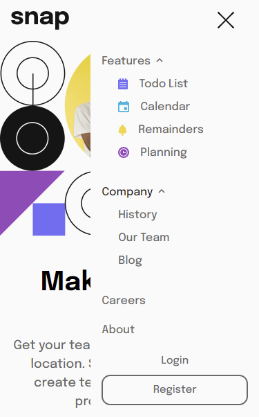

# Frontend Mentor - Intro section with dropdown navigation solution

This is a solution to the [Intro section with dropdown navigation challenge on Frontend Mentor](https://www.frontendmentor.io/challenges/intro-section-with-dropdown-navigation-ryaPetHE5). Frontend Mentor challenges help you improve your coding skills by building realistic projects.

## Table of contents

-   [Overview](#overview)
    -   [The challenge](#the-challenge)
    -   [Screenshot](#screenshot)
    -   [Links](#links)
-   [My process](#my-process)
    -   [Built with](#built-with)
    -   [What I learned](#what-i-learned)
-   [Author](#author)

## Overview

### The challenge

Users should be able to:

-   View the relevant dropdown menus on desktop and mobile when interacting with the navigation links
-   View the optimal layout for the content depending on their device's screen size
-   See hover states for all interactive elements on the page

### Screenshot

### Links

-   Solution URL: [github](https://github.com/augustine-a8/intro-section-with-dropdown-navigation.git)
-   Live Site URL: [live site](https://augustine-a8.github.io/intro-section-with-dropdown-navigation/)

## My process

### Built with

-   HTML
-   CSS custom properties
-   JavaScript
-   CSS Grid
-   Responsive Web Design
-   Mobile-first workflow

### What I learned

Learned to use javascript to manipulate the dom to make dynamic content like hiding and showing the dropdowns.

## Author

-   Frontend Mentor - [@augustine-a8](https://www.frontendmentor.io/profile/augustine-a8)
